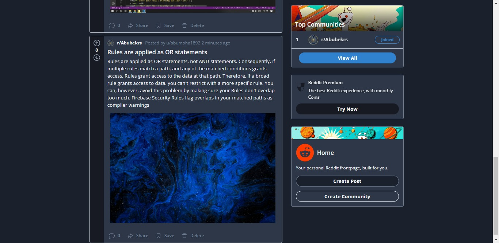
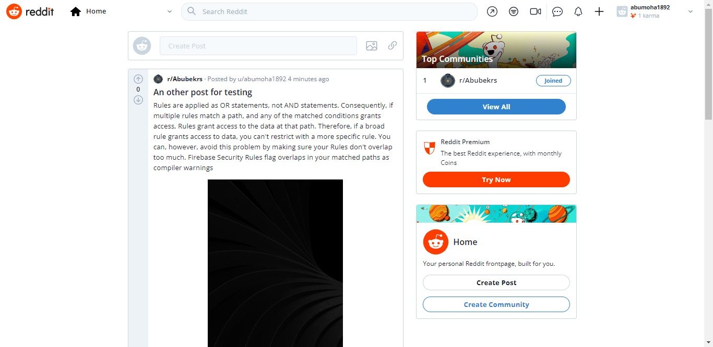
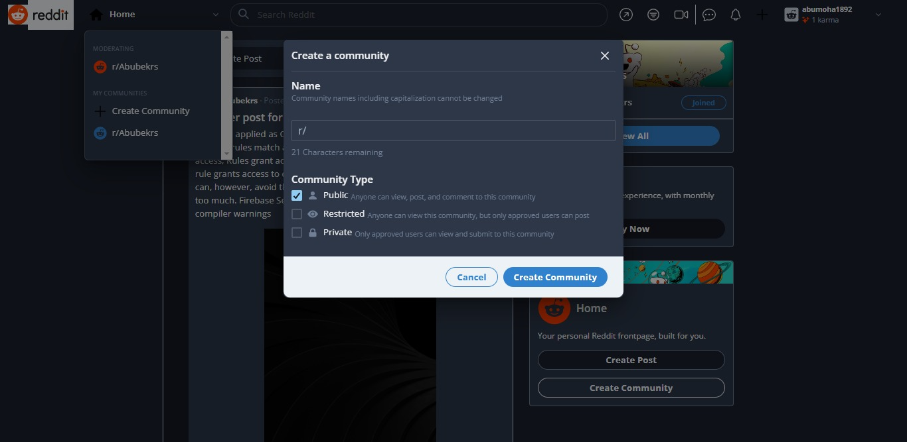
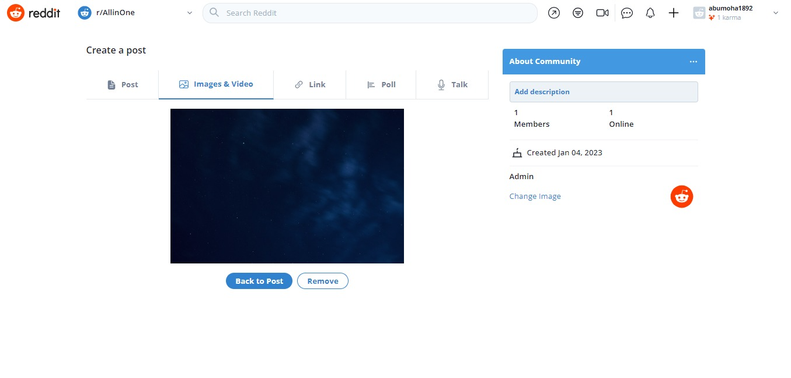
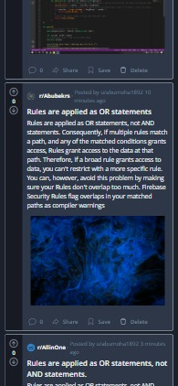
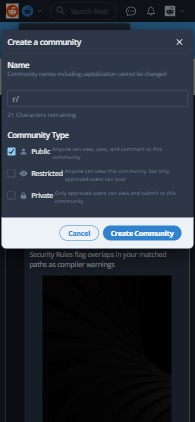

## Getting Started with ReadIt

A Next.js reddit clone to showcase UI designing using chakra UI design, firebase backend as a service integration and general best practices for developing production ready apps.

## Give it a star if you like it.

below are some screenshots:

<table>
<tr>
  <th>HomePage[Desktop|Dark]</th>
  <th>HomePage[Desktop|Light]</th>
 </tr>
  <tr>
    <td> </td>
    <td></td>
  </tr>
  <tr>
    <th>CreateCommunity[Desktop|Dark]</th>
    <th>CreatePost[Desktop|Light]</th>
  <tr>
    <td> </td>
    <td></td>
  </tr>
  <tr>
    <th>HomePage[Mobile|Dark]</th>
    <th>CreateCommunity[Mobile|Dark]</th>
  <tr>
    <td> </td>
    <td></td>
  </tr>
</table>

Visit live site @[vercel](https://read-it-reddit-clone-pfk4.vercel.app/)
